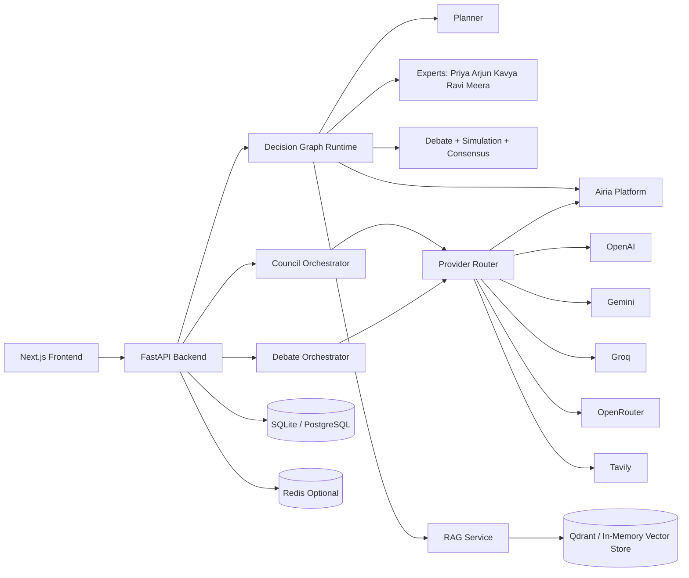
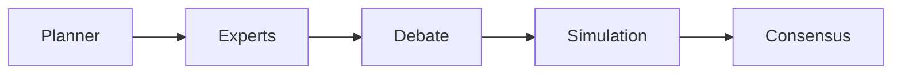
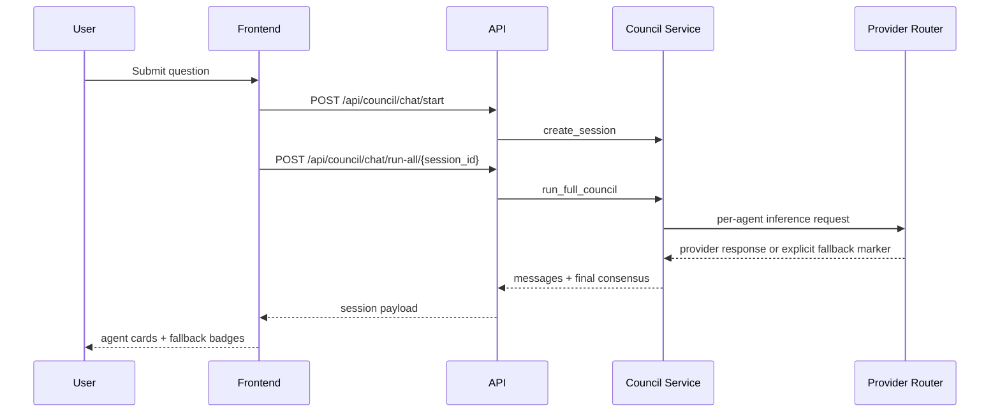

# OmniMind AI

Autonomous multi-agent decision intelligence platform with two orchestration modes:

- Council mode: 7-agent deliberation workflow
- Debate mode: 4-agent structured argument workflow

The platform includes a FastAPI backend, a Next.js frontend, RAG-backed knowledge retrieval, scenario simulation, and consensus synthesis.

## System Overview

| Area | Implementation |
|---|---|
| Frontend | Next.js 14, TypeScript, Tailwind CSS |
| Backend | FastAPI, Python 3.13, Uvicorn |
| Primary LLM Path | Airia (Llama 3.1 70B agent) |
| Additional Providers | OpenAI, Gemini, Groq, OpenRouter, Tavily |
| Decision Graph | LangGraph workflow pipeline |
| Data | SQLite (local) or PostgreSQL (prod) |
| Vector/RAG | Sentence Transformers + in-memory fallback / Qdrant |
| Optional Cache/Memory | Redis |

## Quick Start

### Windows

```bat
start-full-system.bat
```

### Linux/macOS

```bash
./start-full-system.sh
```

### Local Endpoints

| URL | Service |
|---|---|
| http://localhost:3000 | Frontend |
| http://localhost:8000 | Backend API |
| http://localhost:8000/docs | Swagger UI |
| http://localhost:8000/health | Service health |
| http://localhost:8000/api/airia/status | Airia provider status |
| http://localhost:8000/api/council/health | Council provider and routing health |

## Architecture Diagrams

### High-Level Runtime Topology



### Decision Workflow (Runtime Graph)



### Request Sequence (Council Run-All)



## Council Mode (7 Agents)

| Agent | Role | Requested Provider | Typical Model |
|---|---|---|---|
| Analyst | Logical reasoning | OpenAI | GPT-4o |
| Researcher | Evidence synthesis | OpenAI + Tavily | GPT-4o |
| Critic | Risk/challenge lens | Gemini | Gemini 1.5 Flash |
| Strategist | Plan framing | Gemini | Gemini 1.5 Flash |
| Debater | Counter-positions | Groq | Llama 3.1 |
| Synthesizer | Pattern merge | Groq | Llama 3.1 |
| Verifier | Consensus | Hybrid (Airia-first) | Llama 3.1 70B |

## Debate Mode (4 Agents)

| Persona | Role | Primary Provider |
|---|---|---|
| Priya | Research and intelligence | Tavily + OpenAI |
| Arjun | Risk analysis | OpenRouter |
| Kavya | Financial and resource strategy | OpenAI |
| Ravi | Strategy and execution | Gemini |

## Airia-First and Provider Drift Policy

The backend now enforces explicit routing semantics:

| Rule | Behavior |
|---|---|
| Airia-first fallback | If a requested provider is unavailable/fails, the system attempts Airia fallback first |
| No silent cross-provider drift | No hidden OpenAI->Gemini or Gemini->Groq substitution without markers |
| Marker propagation | Responses include explicit fallback markers in payload/text |
| UI visibility | Frontend surfaces fallback badges and provider requested/used metadata |

Marker format:

```text
[FALLBACK requested=<provider> used=<provider|none> reason=<reason_code>]
```

## Persona Output Shape Validation

Persona outputs are now validated against required structures.

| Persona | Required Shape Constraints |
|---|---|
| Priya | Must include confidence and explicit data gaps |
| Arjun | Must include critical, manageable, and acceptable risk tiers |
| Kavya | Must include rupee-denominated financial table with investment, monthly cost, break-even, 3-year ROI |
| Ravi | Must include phased roadmap: 0-30 days, 31-90 days, 91-180 days |
| Meera | Must include scheme details, deadlines, and required documents |

Validation failure marker format:

```text
[VALIDATION_FAILED persona=<name> missing=<fields>]
```

## Progressive Backend Reorganization

The backend has started transitioning toward an app-style module layout with compatibility shims.

| Path | Purpose |
|---|---|
| backend/app/api/routes | New app-style route package |
| backend/app/api/routes/* | Compatibility shims re-exporting legacy route modules |
| backend/app/services | New service namespace for reorganized modules |
| backend/services/persona_output_validator.py | Shim importing app-style validator module |

Current API behavior remains backward compatible while structure evolves.

## API Surface

### Core Workflow

| Method | Path | Description |
|---|---|---|
| POST | /api/queries | Start full decision workflow |
| GET | /api/queries/{id} | Fetch workflow state |
| GET | /api/queries/{id}/export?format=json\|pdf | Export decision artifact |
| WS | /api/queries/{id}/stream | Stream workflow events |
| POST | /api/simulations | Run scenario simulation |

### Human-in-the-Loop (HITL)

| Method | Path | Description |
|---|---|---|
| POST | /api/queries/{id}/hitl/decision | Approve or reject a workflow gate |
| GET | /api/queries/{id}/hitl | List recorded gate decisions |

### Integrations

| Method | Path | Description |
|---|---|---|
| GET | /api/integrations/status | Connectivity status for Airia/Gmail/Calendar |
| POST | /api/queries/{id}/integrations/execute | Execute integration actions (Gmail/Calendar) |
| GET | /api/queries/{id}/integrations | Fetch integration execution history |

### Council

| Method | Path | Description |
|---|---|---|
| GET | /api/council/health | Provider + routing status |
| GET | /api/council/agents | List council agents |
| POST | /api/council/chat/start | Create council session |
| POST | /api/council/chat/run-all/{session_id} | Execute full council sequence |

### Debate

| Method | Path | Description |
|---|---|---|
| POST | /api/debate/run | Execute debate pipeline |

## Environment Variables

| Variable | Used For |
|---|---|
| AIRIA_API_KEY | Primary/fallback inference path |
| AIRIA_API_URL | Airia endpoint base URL |
| AIRIA_AGENT_ID | Optional Airia agent routing |
| GRADIENT_API_KEY | Legacy fallback alias for AIRIA_API_KEY |
| GRADIENT_BASE_URL | Legacy fallback alias for AIRIA_API_URL |
| GRADIENT_WORKSPACE_ID | Legacy fallback alias for AIRIA_AGENT_ID |
| OPENAI_API_KEY | Council OpenAI agents |
| OPENAI_RESEARCH_API_KEY | Priya research analysis |
| OPENAI_FINANCE_API_KEY | Kavya financial analysis |
| GOOGLE_API_KEY | Council Gemini agents |
| GEMINI_API_KEY | Ravi strategy analysis |
| GROQ_API_KEY | Council Groq agents |
| OPENROUTER_API_KEY | Arjun risk analysis |
| TAVILY_API_KEY | Live search enrichment |
| DATABASE_URL | SQL persistence layer |
| REDIS_URL | Optional cache/memory services |
| QDRANT_URL | Optional vector store |

## Development Notes

| Script | Description |
|---|---|
| start-full-system.sh / .bat | Start backend and frontend |
| start-backend.sh / .bat | Start backend only |
| start-frontend.sh / .bat | Start frontend only |
| troubleshoot.sh / .bat | Run diagnostics |

## License

MIT
